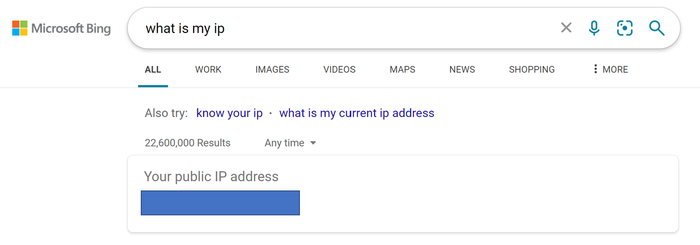
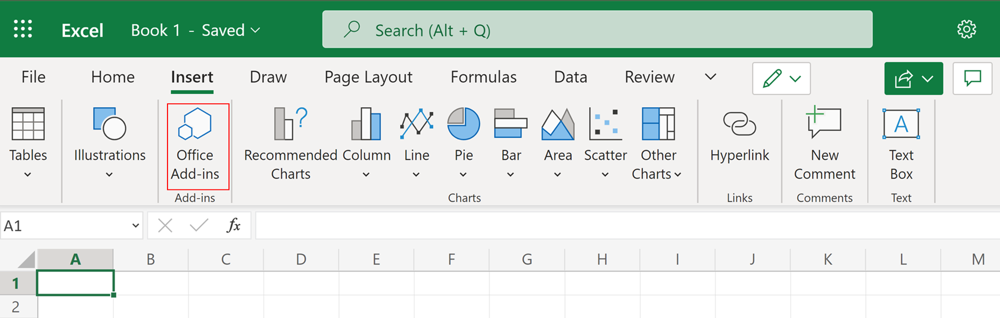
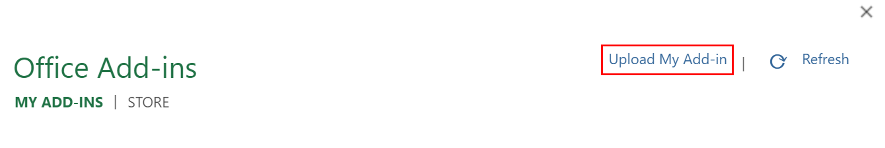
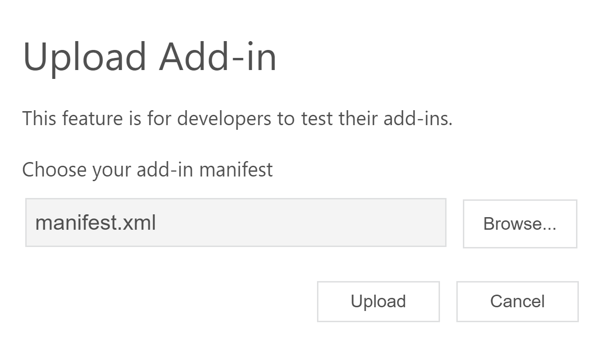

# ML.NET on Excel

This project showcases the consumption of ML.NET models in Excel as an add-in

## Project Structure

- src
    - MLModels: .NET Class Library used to train models
    - MLBlazorExcelAddIn: Blazor WebAssembly application containing the Excel Add-In 

## Prerequisites

- [.NET 6 SDK](https://dotnet.microsoft.com/download/dotnet/6.0)
- [Azure Storage Account](https://docs.microsoft.com/azure/storage/common/storage-account-create?tabs=azure-portal)
    - [Enable static website hosting](https://docs.microsoft.com/azure/storage/blobs/storage-blob-static-website-how-to?tabs=azure-portal)
- [Microsoft Account](https://support.microsoft.com/account-billing/how-to-create-a-new-microsoft-account-a84675c3-3e9e-17cf-2911-3d56b15c0aaf)
- [Visual Studio 2022](https://visualstudio.microsoft.com/downloads/)(Optional)
- [Azure Storage Explorer](https://azure.microsoft.com/features/storage-explorer/)(Optional)

## Instructions

These instructions will help you get this project up and running.

### Upload model to Azure Storage Account

1. In your Azure Storage account, create a new container called `models`. For more information on how to create a container, see [Create a container](https://docs.microsoft.com/azure/storage/blobs/storage-quickstart-blobs-portal#create-a-container).
1. Upload the *IrisClassification.zip* file in the *MLModels* project directory to the `models` directory. Once uploaded, enable blob storage. For more information on uploading files to a container, see [Upload a block blob](https://docs.microsoft.com/azure/storage/blobs/storage-quickstart-blobs-portal#upload-a-block-blob).
1. Open the *Index.razor* in the *MLBlazorExcelAddIn/Pages* directory in your preferred text editor.
1. Update the `_modelUrl` value with the URL of the blob containing your blob.

    ```csharp
    _modelUrl = "<YOUR-MODEL-BLOB-URL>";
    ```

### Update the add-in manifest.xml

1. Open the *manifest.xml* file in the *MLBlazorExcelAddIn/wwwroot* directory in your preferred text editor.
1. Find the text "<STATIC-WEBSITE-URL>" and replace with the URL of your static website.

### Build the MLBlazorExcelAddIn project

1. Open a terminal and navigate to the *MLBlazorExcelAddIn* project directory.

    ```bash
    cd src/MLBlazorExcelAddIn
    ```

1. Enter the following command to build the project:

    ```dotnetcli
    dotnet publish -c Release
    ```

The output from the build process is stored in the *MLBlazorExcelAddIn/bin/Release/net6.0/publish/wwwroot* directory.

### Upload Excel Add-In to static website

Upload the contents from the *MLBlazorExcelAddIn/bin/Release/net6.0/publish/wwwroot* directory to the `$web` Azure Blob Storage container. For more information on uploading files to your Azure static website, see [Upload files to static website](https://docs.microsoft.com/azure/storage/blobs/storage-blob-static-website-how-to?tabs=azure-portal#upload-files).

### Configure CORS for your static website

1. Navigate to your Azure Storage resource in the Azure Portal.
1. Open the **Settings > Resource sharing (CORS)** page.
1. Select the **Blob service** tab. 
1. Add entries for the following origins:

    | Allowed origins | Allowed methods |
    | --- | --- |
    | YOUR-STATIC-WEBSITE-URL | GET,POST |
    | YOUR-PUBLIC-IP-ADDRESS | GET,POST |
    | https://ppc-excel.officeapps.live.com | GET, POST |
    
    

    Replace `YOUR-STATIC-WEBSITE-URL` with the URL you used in the *manifest.xml* file and `YOUR-PUBLIC-IP-ADDRESS` with your public IP address. To find your public IP address, navigate to bing.com and enter the search query ["What is my IP"](https://www.bing.com/search?q=what+is+my+ip).

    

### Upload add-in

1. In your browser, navigate to [excel.office.com](https://excel.microsoft.com)
1. Create a new blank workbook. For more information on how to create a new blank workbook, see [Create a workbook in Excel for the web](https://support.microsoft.com/office/create-a-workbook-in-excel-for-the-web-63b50461-38c4-4c93-a17e-36998be0e3d0).
1. In the workbook, open the Office Add-ins dialog by selecting **Insert > Office Add-Ins** in the ribbon pane.

    
1. In the Office Add-Ins dialog, select **My organization** tab.
1. Select **Upload My Add-in** to open up the upload add-in dialog.

    

1. Select **Browse** and use the file explorer to choose the *manifest.xml* file.
1. Select **Upload**.

    

After a few seconds, your add-in is loaded. For more information on uploading your add-in, see [Sideload an Office Add-in in Office on the web manually](https://docs.microsoft.com/office/dev/add-ins/testing/sideload-office-add-ins-for-testing#sideload-an-office-add-in-in-office-on-the-web-manually)

### Use the add-in to make predictions

1. Add the following data to the first row of your workbook.

| A | B | C | D |
| --- | --- | --- | --- |
|5.1 | 3.5 | 1.4 | 0.2 |

1. Use the `MLNET.IRIS.PREDICT` custom function defined by your add-in to make a predictions using the data you previously entered as inputs.

    

Your prediction should display in the cell where you used the custom function.

Congratulations! You've now used an ML.NET model to make predictions in Excel!

## Next Steps

- Train your own model.

## Resources

- [ML.NET](https://dot.net/ml)
- [ML.NET Documentation](https://docs.microsoft.com/dotnet/machine-learning/)
- [ML.NET Samples](https://github.com/dotnet/machinelearning-samples)
- [Excel Add-Ins Overview](https://docs.microsoft.com/office/dev/add-ins/excel/excel-add-ins-overview)