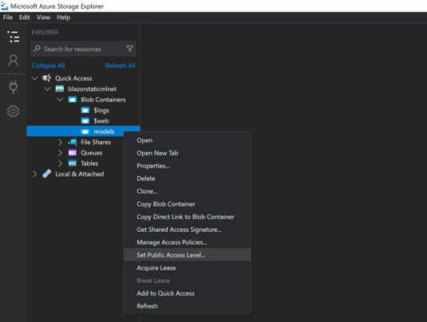
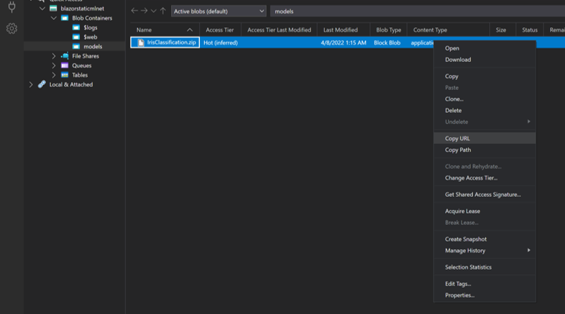
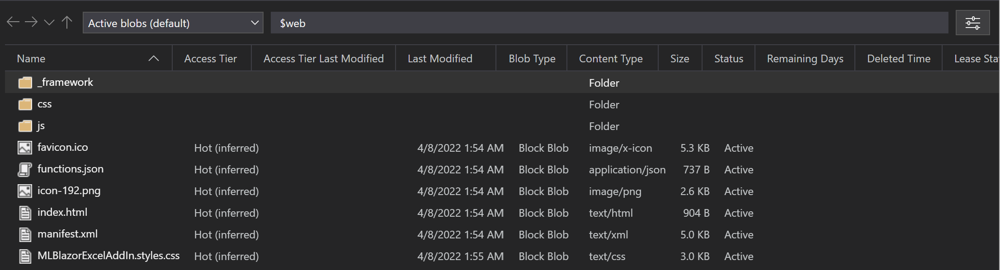
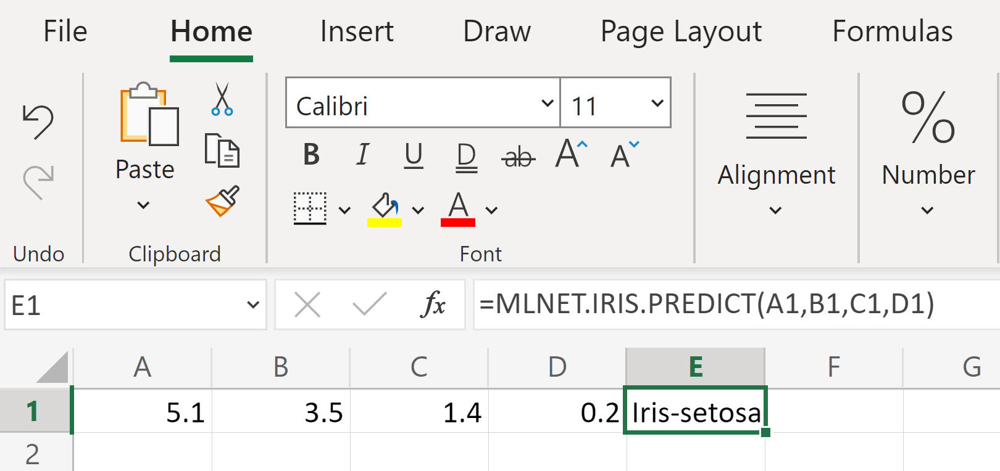

# ML.NET on Excel

This project showcases the consumption of ML.NET models in Excel as an add-in.

## Statement of Purpose
This repository aims to grow the understanding of consuming ML.NET models in Excel by providing an example of implementation and references to support the [Microsoft Build conference in 2022](https://mybuild.microsoft.com/). It is not intended to be a released product. Therefore, this repository is not for discussing ML.NET, Excel add-in or requesting new features.

## Table of Contents

- [Project Structure](#project-structure)
- [Prerequisites](#prerequisites)
- [Instructions for running the application](#instructions)
- [Next Steps: Train your own model](#next-steps-train-your-own-model)
- [FAQ/Troubleshooting](#faq--troubleshooting)

## Project Structure

- src
    - MLModels: .NET Class Library used to train models
    - MLBlazorExcelAddIn: Blazor WebAssembly application containing the Excel add-in.
        - *wwwroot/functions.json*: Metadata about the custom functions contained in your add-in.
        - *js/interop.js*: Code to set up JavaScript interop with Blazor and get data from Excel.
        - *Pages/Index.cshtml*: Main page containing the UI displayed in the addin as well as the code to make predictions using ML.NET.

## Prerequisites

- [.NET 6 SDK](https://dotnet.microsoft.com/download/dotnet/6.0)
- [Microsoft Account](https://support.microsoft.com/account-billing/how-to-create-a-new-microsoft-account-a84675c3-3e9e-17cf-2911-3d56b15c0aaf)
- Azure Storage Account with static website hosting enabled

    **RECOMMENDED**: To simplify the process of setting up an Azure Storage account with static website hosting, use this ARM template:

    [](https://portal.azure.com/#create/Microsoft.Template/uri/https%3A%2F%2Fgist.githubusercontent.com%2Fluisquintanilla%2Ff0fd8e9149bd65051cec76db590c51f4%2Fraw%2F8d7383769810f99529f453f4dcef588480347d65%2Fazuredeploy.json)

    Using the ARM template, create a new resource group or provide an existing one for your storage account to be placed in. Leave the defaults for the rest of the fields.

    If you prefer to set up the storage account and static website manually, use the following guides to:

  - [Create an Azure Storage Account](https://docs.microsoft.com/azure/storage/common/storage-account-create?tabs=azure-portal)
  - [Enable static website hosting](https://docs.microsoft.com/azure/storage/blobs/storage-blob-static-website-how-to?tabs=azure-portal)
- [Azure Storage Explorer](https://azure.microsoft.com/features/storage-explorer/)
- (Optional) [Visual Studio 2022](https://visualstudio.microsoft.com/downloads/)

## Instructions

These instructions will help you get this project up and running.

### Upload model to Azure Storage Account

1. In your Azure Storage account, create a new container called `models` using Azure Storage Explorer. For more information on how to create a container using Azure Storage Explorer, see [Create a container](https://docs.microsoft.com/azure/storage/blobs/quickstart-storage-explorer#create-a-container).
1. Set the public access level of the container to **Public read access for blobs only**. To do so using Azure Storage Explorer:
    1. Right-click the `models` container and select **Set Public Access Level...***.

        

    1. In the Set Container Public Access dialog, choose **Public read access for blobs only**.
    1. Select **Apply**
1. Upload the *IrisClassification.zip* file in the *MLModels* project directory to the `models` container. Once uploaded, enable blob storage. For more information on uploading files to a container, see [Upload blobs to the container](https://docs.microsoft.com/azure/storage/blobs/quickstart-storage-explorer#upload-blobs-to-the-container).
1. Copy the URL of your *IrisClassification.zip* blob to your clipboard. To do so in Azure Storage Explorer, right-click your blob and select **Copy URL**. 

    

1. Open the *Index.razor* in the *MLBlazorExcelAddIn/Pages* directory in your preferred text editor.
1. Update the `_modelUrl` value with the URL you copied in previous steps.

    ```csharp
    _modelUrl = "YOUR-MODEL-BLOB-URL";
    ```

### Update the add-in manifest.xml

1. Open the *manifest.xml* file in the *MLBlazorExcelAddIn/wwwroot* directory in your preferred text editor.
1. Find the text "STATIC-WEBSITE-URL" and **replace all** instances with the URL of your static website. For more information on finding your static website URL, see [Find the website URL](https://docs.microsoft.com/azure/storage/blobs/storage-blob-static-website-how-to?tabs=azure-portal#find-the-website-url).

### Build the MLBlazorExcelAddIn project

1. Open a terminal and navigate to the *MLBlazorExcelAddIn* project directory.

    ```bash
    cd src/MLBlazorExcelAddIn
    ```

1. Enter the following command to build and publish the project:

    ```dotnetcli
    dotnet publish -c Release
    ```

The output from the build process is stored in the *MLBlazorExcelAddIn/bin/Release/net6.0/publish/wwwroot* directory.

**MacOS - If you run into an error similar to "The "GetFileHash" task failed unexpectedly" building and publishing your application, see the [FAQ section](#the-getfilehash-task-failed-unexpectedly).** 

### Upload Excel Add-In to static website

Use Azure Storage Explorer to upload the contents from the *MLBlazorExcelAddIn/bin/Release/net6.0/publish/wwwroot* directory to the `$web` Azure Blob Storage container. For more information on uploading files to your Azure static website container using Azure Storage Explorer, see [Upload blobs to the container](https://docs.microsoft.com/azure/storage/blobs/quickstart-storage-explorer#upload-blobs-to-the-container).

The contents of your `$web` container should look similar to the following.



### Configure CORS for your static website

1. Navigate to your Azure Storage resource in the Azure Portal.
1. Open the **Settings > Resource sharing (CORS)** page.
1. Select the **Blob service** tab. 
1. Add entries for the following origins:

    | Allowed origins | Allowed methods |
    | --- | --- |
    | YOUR-STATIC-WEBSITE-URL | GET |
    | 0.0.0.0 | GET |
    | https://ppc-excel.officeapps.live.com | GET |

    

    Replace `YOUR-STATIC-WEBSITE-URL` with the URL you used in the *manifest.xml* file.

    **NOTE: Make sure to remove the last backslash from the URL (i.e. https://\<storage-acct-name\>.z14.web.core.windows.net/ should be https://\<storage-acct-name\>.z14.web.core.windows.net)**

### Upload add-in

1. In your browser, navigate to [excel.office.com](https://excel.office.com).
1. Log in using your Microsoft Account. 
1. Create a new blank workbook. For more information on how to create a new blank workbook, see [Create a workbook in Excel for the web](https://support.microsoft.com/office/create-a-workbook-in-excel-for-the-web-63b50461-38c4-4c93-a17e-36998be0e3d0).
1. In the workbook, open the Office Add-ins dialog by selecting **Insert > Office Add-Ins** in the ribbon pane.

    

1. In the Office Add-Ins dialog, select **Upload My Add-in** to open up the upload add-in dialog.

    

1. Select **Browse** and use the file explorer to choose the *manifest.xml* file.
1. Select **Upload**.

    

After a few seconds, your add-in is loaded. For more information on uploading your add-in, see [Sideload an Office Add-in in Office on the web manually](https://docs.microsoft.com/office/dev/add-ins/testing/sideload-office-add-ins-for-testing#sideload-an-office-add-in-in-office-on-the-web-manually)

### Use the add-in to make predictions

1. Add the following data to the first row of your workbook.

    | A | B | C | D |
    | --- | --- | --- | --- |
    |5.1 | 3.5 | 1.4 | 0.2 |

1. Use the `MLNET.IRIS.PREDICT` custom function defined by your add-in to make a predictions using the data you previously entered as inputs.

    

Your prediction should display in the cell where you used the custom function.

Congratulations! You've now used an ML.NET model to make predictions in Excel!

## Clean up resources

### Remove Excel Add-In

To remove the Excel add-in from your account, clear your browser cache. 

This sample was tested using Microsoft Edge. For more information on clearing your cache on Microsoft Edge, see [View and delete browser history in Microsoft Edge](https://support.microsoft.com/microsoft-edge/view-and-delete-browser-history-in-microsoft-edge-00cf7943-a9e1-975a-a33d-ac10ce454ca4)

### Delete Azure resources

The Azure resources that you created in this sample can incur ongoing costs. To avoid such costs, delete the resource group that contains all those resources. For more information on deleting resource groups, see [Delete resource groups](https://docs.microsoft.com/azure/azure-resource-manager/management/manage-resource-groups-portal#delete-resource-groups).

## Next Steps: Train your own model

Now that you've used the sample to make predictions with a pretrained ML.NET model in Excel, it's time to train your own model. The machine learning task used for this section is still classification, but the scenario the model is used in is to categorize the risk level of restaurant violations found during health inspections.

### Understand the data

The data set used to train and evaluate the machine learning model is originally from the [San Francisco Department of Public Health Restaurant Safety Scores](https://www.sfdph.org/dph/EH/Food/score/default.asp). For convenience, the dataset has been condensed to only include the columns relevant to train the model and make predictions. Visit the following website to learn more about the [dataset](https://data.sfgov.org/Health-and-Social-Services/Restaurant-Scores-LIVES-Standard/pyih-qa8i?row_index=0).

Each row in the dataset contains information regarding violations observed during an inspection from the Health Department and a risk assessment of the threat those violations present to public health and safety.

| InspectionType | ViolationDescription | RiskCategory
| --- | --- | --- |
Routine - Unscheduled | Inadequately cleaned or sanitized food contact surfaces | Moderate Risk
New Ownership | High risk vermin infestation | High Risk
Routine - Unscheduled | Wiping cloths not clean or properly stored or inadequate sanitizer | Low Risk

- **InspectionType:** the type of inspection. This can either be a first-time inspection for a new establishment, a routine inspection, a complaint inspection, and many other types.
- **ViolationDescription:** a description of the violation found during inspection.
- **RiskCategory:** the risk severity a violation poses to public health and safety.

The `label` is the column you want to predict. When performing a classification task, the goal is to assign a category (text or numerical). In this classification scenario, the severity of the violation is assigned the value of low, moderate, or high risk. Therefore, the **RiskCategory is the label**. The `features` are the inputs you give the model to predict the label. In this case, the **InspectionType and ViolationDescription are used as features or inputs to predict the RiskCategory**.

### Prerequisites

In ML.NET, you have the option of using low-code tooling powered by AutoML like ML.NET Model Builder and the ML.NET CLI to train machine learning models. You also have the option of using the ML.NET API which provides all of the components required to train and consume models through code-first .NET experiences. 

Model Builder is a Visual Studio extension that provides a wizard-like user-interface for Windows environments. The ML.NET CLI is a .NET global tool that provides similar functionality to Model Builder through the command-line for cross-platform experiences across x64 / ARM64 devices running Windows, Mac, or Linux. For this sample, you'll use the ML.NET CLI.

- [Install the ML.NET CLI](https://docs.microsoft.com/dotnet/machine-learning/how-to-guides/install-ml-net-cli?tabs=windows)
- [Download the Restaurant Safety Scores dataset](https://github.com/dotnet/machinelearning-samples/raw/main/samples/modelbuilder/MulticlassClassification_RestaurantViolations/RestaurantScores.zip) and unzip it.

### Train the model

> If you prefer to train the model using Model Builder, see [Classify the severity of restaurant health violations with Model Builder](https://docs.microsoft.com/dotnet/machine-learning/tutorials/health-violation-classification-model-builder).

1. Open the terminal and navigate to the *MLNETExcel/src* directory.
1. Use the ML.NET CLI to train a classification model.

```dotnetcli
mlnet classification --dataset C:\Datasets\RestaurantScores.csv --has-header true --label-col risk_category --name InspectionClassification --train-time 60
```

Make sure to replace the `--dataset` parameter with the location where you unzipped the *RestaurantScores.csv* file containing the dataset.

This command uses AutoML to search for the best algorithm and hyperparameters for your dataset and trains an ML.NET model in the span of 60 seconds (as specified by the `--train-time` option). 

Once the training process is complete, a new .NET console project containing the model as well as training and consumption code is created in the *MLNETExcel/src/InspectionClassification* directory.

### Configure InspectionClassification project

By default, the ML.NET CLI creates a .NET console project that can be immediately used to make predictions with your newly trained model. The resulting output is an executable. However, since the model is intended to be consumed by the `MLBlazorExcelAddIn` application and not as an executable, you need to configure the output type of the `InspectionClassification.ConsoleApp` project. 

1. Navigate to the *MLNETExcel/src/InspectionClassification* directory.
1. Open the *InspectionClassification.ConsoleApp.csproj* file in your preferred text editor.
1. Delete the following XML attribute:

    ```xml
    <OutputType>Exe</OutputType>
    ```

    Removing this attribute changes the output type from an executable to a Dynamically Linked Library (DLL).

1. Save your changes
1. (Optional) Delete the *Program.cs* file. Since you're not intending to run the application as an executable, there's no need for the application entrypoint defined in the *Program.cs* file.
1. Open the terminal inside the *MLNETExcel/src/InspectionClassification* directory.
1. Use the .NET CLI to clean the build output and rebuild the project.

    ```dotnetcli
    dotnet clean
    dotnet build
    ```

In your build output directory (*bin/Debug/net6.0*) you should see a file *InspectionClassification.ConsoleApp.dll* file.

### Add project reference

To use the inspection model in your `MLBlazorExcelAddIn` project, add a reference to it.

1. Open the terminal and navigate to the *MLNETExcel/src/MLBlazorExcelAddIn* directory.
1. Use the .NET CLI to add a reference to the `InspectionClassification.ConsoleApp` project.

    ```dotnetcli
    dotnet add reference ..\InspectionClassification\InspectionClassification.ConsoleApp.csproj
    ```

1. Open the *_Imports.razor* file inside the *MLNETExcel/src/MLBlazorExcelAddIn* directory in your preferred text editor.
1. Add the following using statement to the file.

    ```csharp
    @using InspectionClassification.ConsoleApp
    ```

### Upload inspection model to Azure Blob Storage

Use Azure Storage Explorer to upload the *InspectionClassification.zip* model file to the `models` container. For more details, follow the guidance from the [Upload model to Azure Storage Account](#upload-model-to-azure-storage-account) section.

### Update Index.razor

The *Index.razor* page contains the logic for loading the model from Azure Blob Storage and making predictions. Therefore it requires a few updates before using it to make predictions with the model.

1. Open the *Index.razor* page in the *MLNETExcel/src/MLBlazorExcelAddIn* in your preferred text editor. 
1. Update the `_predictionEngine` variable declaration to use the `InspectionClassification.ModelInput` and `InspectionClassification.ModelOutput` schema classes.

    ```csharp
    private PredictionEngine<InspectionClassification.ModelInput, InspectionClassification.ModelOutput> _predictionEngine;
    ```

1. Inside the `OnInitializedAsync` method:
    1. Update the `_modelUrl` variable with the the URL of the *InspectionClassification.zip* model file you recently uploaded to Azure Blob Storage.
    1. Update the value of `_predictionEngine` to use initialize a PredictionEngine with the `INspectionClassification.ModelInput` and `InspectionClassification.ModelOutput` classes.

        ```csharp
        _predictionEngine = mlContext.Model.CreatePredictionEngine<InspectionClassification.ModelInput,InspectionClassification.ModelOutput>(_model);
        ```

1. Replace the current `MakePrediction` method with the following:

    ```csharp
    public string MakePrediction(string inspectionType, string violationDescription)
    {
        var input = new InspectionClassification.ModelInput
        {
            Inspection_type = inspectionType,
            Violation_description = violationDescription
        };
    
        var prediction = _predictionEngine.Predict(input);
    
        return prediction.PredictedLabel;
    }
    ```

    The main changes form the previous implementation are the parameters in the method signature which are used to create an instance of `InspectionClassification.ModelInput` that is assigned to the `input` variable. 

### Update JavaScript interop functions

The way predictions are made in Excel is using custom functions. The code to pass data from Excel to make predictions using the Blazor application is in the *wwwroot/js/interop.js* file inside the `MLBlazorExcelAddIn` project.

1. Open the *interop.js* file in your preferred text editor.
1. Inside the `MLFunctions` class, update the `predict` function with the following code.

    ```javascript
    static async predict(inspectionType, violationDescription) {
        const prediction = await MLFunctions.dotNetHelper.invokeMethodAsync('MakePrediction', inspectionType, violationDescription);
        console.log(prediction);
        return prediction;
    }
    ```

    Like the `MakePrediction` method in the `Index.razor` file, the main changes from the previous implementation are the parameters in the function signature which are the inputs for the `MakePrediction` function. 

1. Update the name of the function used in the in the custom function `associate` function to `INSPECTION.PREDICT`.

    ```javascript
    CustomFunctions.associate("INSPECTION.PREDICT", MLFunctions.predict);
    ```

### Update Excel custom function schema

Now that you've updated the code, its time to make it discoverable. This is done through the *functions.json* file in the *src/wwwroot* directory inside the `MLBlazorExcelAddIn` project. The *functions.json* contains metadata about the custom functions registered in your Excel Add-In.

1. Open the *functions.json* file in your preferred text editor.
1. Replace the contents of the file with the following:

    ```json
    {
      "functions": [
        {
          "description": "Categorize health inspections",
          "id": "INSPECTION.PREDICT",
          "name": "INSPECTION.PREDICT",
          "parameters": [
            {
              "description": "Type of inspection",
              "name": "inspectionType",
              "type": "string"
            },
            {
              "description": "Detailed explanation of violation",
              "name": "violationDescription",
              "type": "string"
            }
          ],
          "result": {
            "type": "string"
          }
        }
      ]
    }
    ```

    The `description`, `id`, `name`, and `parameters` properties have changed from the previous version to reflect your custom function for predicting violation severity.

### Rebuild the project and update static website

Now that you've update the application, it's time to build a new version with the latest updates. 

1. Open the terminal and navigate to the *MLNETExcel/src/MLBlazorExcelAddIn* directory.
1. Use the .NET CLI to build and publish your application.

    ```dotnetcli
    dotnet clean
    dotnet publish -c Release
    ```

    The output from the build process is stored in the *MLBlazorExcelAddIn/bin/Release/net6.0/publish/wwwroot* directory.

1. Use Azure Storage Explorer to upload the contents from the *MLBlazorExcelAddIn/bin/Release/net6.0/publish/wwwroot* directory to the `$web` Azure Blob Storage container. **NOTE: Many of the files will already exist. To prevent conflicts, it's recommended that you delete the contents of the blob storage before uploading the new version of your application.**.

### Re-upload manifest.xml

You shouldn't have to re-upload your manifest.xml file. However, if you cleared your cache or the add-in is no longer available in the Excel client, follow the steps in the [Upload Excel Add-In](#upload-add-in) section to upload the *manifest.xml* file to Excel.

### Use the model to predict violation severity

1. Add the following data to the first row of your workbook.

    | A | B |
    | --- | --- |
    | Complaint | Inadequate sewage or wastewater disposal |

1. Use the `MLNET.INSPECTION.PREDICT` custom function defined by your add-in to make a predictions using the data you previously entered as inputs.

Your prediction should display in the cell where you used the custom function.

Congratulations! You've now trained a custom ML.NET model and used it to make predictions in Excel!

## Additional Next Steps

- Improve your model. Choose a longer training time. Doing so allows AutoML to explore more models and hyperparameters.
- Publish your office add-in. Doing so makes it easier for others in your organization to access your add-in. For more information on publishing add-ins, see [Deploy and publish Office Add-Ins](https://docs.microsoft.com/office/dev/add-ins/publish/publish).

## FAQ / Troubleshooting

The following are known issues with proposed workarounds

### The "GetFileHash" task failed unexpectedly

On MacOs, you might fail to build the `MLBlazorExcelAddIn` project and get a message like the following:

```text
The "GetFileHash" task failed unexpectedly
```

This is a [known issue in .NET](https://github.com/dotnet/aspnetcore/issues/40328). 

To fix it, run the `dotnet publish -c Release` command again.

### $web container not public

In some instances you might need to make the `$web` container public in order to view your website. For more information, see [Set the public access level for a container](https://docs.microsoft.com/azure/storage/blobs/anonymous-read-access-configure?tabs=portal#set-the-public-access-level-for-a-container).

## Resources

- [ML.NET](https://dot.net/ml)
- [ML.NET Documentation](https://docs.microsoft.com/dotnet/machine-learning/)
- [ML.NET Samples](https://github.com/dotnet/machinelearning-samples)
- [Excel Add-Ins Overview](https://docs.microsoft.com/office/dev/add-ins/excel/excel-add-ins-overview)
