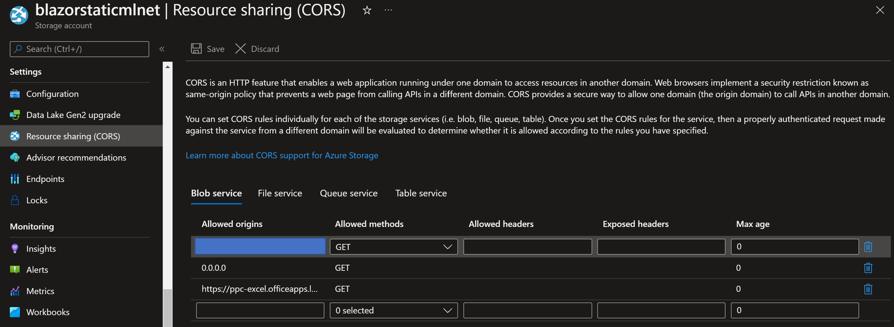

# ML.NET on Excel

This project showcases the consumption of ML.NET models in Excel as an add-in.

## Project Structure

- src
    - MLModels: .NET Class Library used to train models
    - MLBlazorExcelAddIn: Blazor WebAssembly application containing the Excel add-in.
        - *wwwroot/functions.json*: Metadata about the custom functions contained in your add-in.
        - *js/interop.js*: Code to set up JavaScript interop with Blazor and get data from Excel.
        - *Pages/Index.cshtml*: Main page containing the UI displayed in the addin as well as the code to make predictions using ML.NET.

## Prerequisites

- [.NET 6 SDK](https://dotnet.microsoft.com/download/dotnet/6.0)
- [Microsoft Account](https://support.microsoft.com/account-billing/how-to-create-a-new-microsoft-account-a84675c3-3e9e-17cf-2911-3d56b15c0aaf)
- Azure Storage Account with static website hosting enabled

    **RECOMMENDED**: To simplify the process of setting up an Azure Storage account with static website hosting, use this ARM template:

    [](https://portal.azure.com/#create/Microsoft.Template/uri/https%3A%2F%2Fgist.githubusercontent.com%2Fluisquintanilla%2Ff0fd8e9149bd65051cec76db590c51f4%2Fraw%2Ff7f55b564f7429baab568dfa8a28c97473fddc5e%2Fazuredeploy.json)

    Using the ARM template, create a new resource group or provide an existing one for your storage account to be placed in. Leave the defaults for the rest of the fields.

    If you prefer to set up the storage account and static website manually, use the following guides to:

  - [Create an Azure Storage Account](https://docs.microsoft.com/azure/storage/common/storage-account-create?tabs=azure-portal)
  - [Enable static website hosting](https://docs.microsoft.com/azure/storage/blobs/storage-blob-static-website-how-to?tabs=azure-portal)
- [Azure Storage Explorer](https://azure.microsoft.com/features/storage-explorer/)
- (Optional) [Visual Studio 2022](https://visualstudio.microsoft.com/downloads/)

## Instructions

These instructions will help you get this project up and running.

### Upload model to Azure Storage Account

1. In your Azure Storage account, create a new container called `models` using Azure Storage Explorer. For more information on how to create a container using Azure Storage Explorer, see [Create a container](https://docs.microsoft.com/azure/storage/blobs/quickstart-storage-explorer#create-a-container).
1. Set the public access level of the container to **Public read access for blobs only**. To do so using Azure Storage Explorer:
    1. Right-click the `models` container and select **Set Public Access Level...***.

        

    1. In the Set Container Public Access dialog, choose **Public read access for blobs only**.
    1. Select **Apply**
1. Upload the *IrisClassification.zip* file in the *MLModels* project directory to the `models` container. Once uploaded, enable blob storage. For more information on uploading files to a container, see [Upload blobs to the container](https://docs.microsoft.com/azure/storage/blobs/quickstart-storage-explorer#upload-blobs-to-the-container).
1. Copy the URL of your *IrisClassification.zip* blob to your clipboard. To do so in Azure Storage Explorer, right-click your blob and select **Copy URL**. 

    

1. Open the *Index.razor* in the *MLBlazorExcelAddIn/Pages* directory in your preferred text editor.
1. Update the `_modelUrl` value with the URL you copied in previous steps.

    ```csharp
    _modelUrl = "<YOUR-MODEL-BLOB-URL>";
    ```

### Update the add-in manifest.xml

1. Open the *manifest.xml* file in the *MLBlazorExcelAddIn/wwwroot* directory in your preferred text editor.
1. Find the text "STATIC-WEBSITE-URL" and replace with the URL of your static website. For more information on finding your static website URL, see [Find the website URL](https://docs.microsoft.com/azure/storage/blobs/storage-blob-static-website-how-to?tabs=azure-portal#find-the-website-url).

### Build the MLBlazorExcelAddIn project

1. Open a terminal and navigate to the *MLBlazorExcelAddIn* project directory.

    ```bash
    cd src/MLBlazorExcelAddIn
    ```

1. Enter the following command to build the project:

    ```dotnetcli
    dotnet publish -c Release
    ```

The output from the build process is stored in the *MLBlazorExcelAddIn/bin/Release/net6.0/publish/wwwroot* directory.

### Upload Excel Add-In to static website

Use Azure Storage Explorer to upload the contents from the *MLBlazorExcelAddIn/bin/Release/net6.0/publish/wwwroot* directory to the `$web` Azure Blob Storage container. For more information on uploading files to your Azure static website container using Azure Storage Explorer, see [Upload blobs to the container](https://docs.microsoft.com/azure/storage/blobs/quickstart-storage-explorer#upload-blobs-to-the-container).

The contents of your `$web` container should look similar to the following.


### Configure CORS for your static website

1. Navigate to your Azure Storage resource in the Azure Portal.
1. Open the **Settings > Resource sharing (CORS)** page.
1. Select the **Blob service** tab. 
1. Add entries for the following origins:

    | Allowed origins | Allowed methods |
    | --- | --- |
    | YOUR-STATIC-WEBSITE-URL | GET,POST |
    | YOUR-PUBLIC-IP-ADDRESS | GET,POST |
    | https://ppc-excel.officeapps.live.com | GET, POST |
    
    

    Replace `YOUR-STATIC-WEBSITE-URL` with the URL you used in the *manifest.xml* file and `YOUR-PUBLIC-IP-ADDRESS` with your public IP address. To find your public IP address, navigate to bing.com and enter the search query ["What is my IP"](https://www.bing.com/search?q=what+is+my+ip).

    

### Upload add-in

1. In your browser, navigate to [excel.office.com](https://excel.office.com).
1. Log in using your Microsoft Account. 
1. Create a new blank workbook. For more information on how to create a new blank workbook, see [Create a workbook in Excel for the web](https://support.microsoft.com/office/create-a-workbook-in-excel-for-the-web-63b50461-38c4-4c93-a17e-36998be0e3d0).
1. In the workbook, open the Office Add-ins dialog by selecting **Insert > Office Add-Ins** in the ribbon pane.

    
1. In the Office Add-Ins dialog, select **My organization** tab.
1. Select **Upload My Add-in** to open up the upload add-in dialog.

    

1. Select **Browse** and use the file explorer to choose the *manifest.xml* file.
1. Select **Upload**.

    

After a few seconds, your add-in is loaded. For more information on uploading your add-in, see [Sideload an Office Add-in in Office on the web manually](https://docs.microsoft.com/office/dev/add-ins/testing/sideload-office-add-ins-for-testing#sideload-an-office-add-in-in-office-on-the-web-manually)

### Use the add-in to make predictions

1. Add the following data to the first row of your workbook.

    | A | B | C | D |
    | --- | --- | --- | --- |
    |5.1 | 3.5 | 1.4 | 0.2 |

1. Use the `MLNET.IRIS.PREDICT` custom function defined by your add-in to make a predictions using the data you previously entered as inputs.

    

Your prediction should display in the cell where you used the custom function.

Congratulations! You've now used an ML.NET model to make predictions in Excel!

## Clean up resources

### Remove Excel Add-In

To remove the Excel add-in from your account, clear your browser cache.

### Delete Azure resources

The Azure resources that you created in this sample can incur ongoing costs. To avoid such costs, delete the resource group that contains all those resources. For more information on deleting resource groups, see [Delete resource groups](https://docs.microsoft.com/azure/azure-resource-manager/management/manage-resource-groups-portal#delete-resource-groups).

## Next Steps

- Use ML.NET to train your own model. Use tooling like [Model Builder](https://docs.microsoft.com/dotnet/machine-learning/tutorials/health-violation-classification-model-builder) or the [ML.NET API](https://docs.microsoft.com/dotnet/machine-learning/tutorials/github-issue-classification) to train a custom machine learning model using your data. 
- Publish your office add-in. Doing so makes it easier for others in your organization to access your add-in. For more information on publishing add-ins, see [Deploy and publish Office Add-Ins](https://docs.microsoft.com/office/dev/add-ins/publish/publish) 

## Resources

- [ML.NET](https://dot.net/ml)
- [ML.NET Documentation](https://docs.microsoft.com/dotnet/machine-learning/)
- [ML.NET Samples](https://github.com/dotnet/machinelearning-samples)
- [Excel Add-Ins Overview](https://docs.microsoft.com/office/dev/add-ins/excel/excel-add-ins-overview)